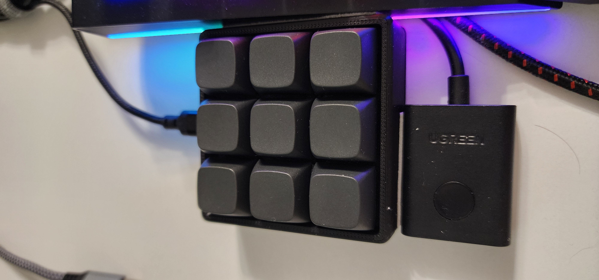
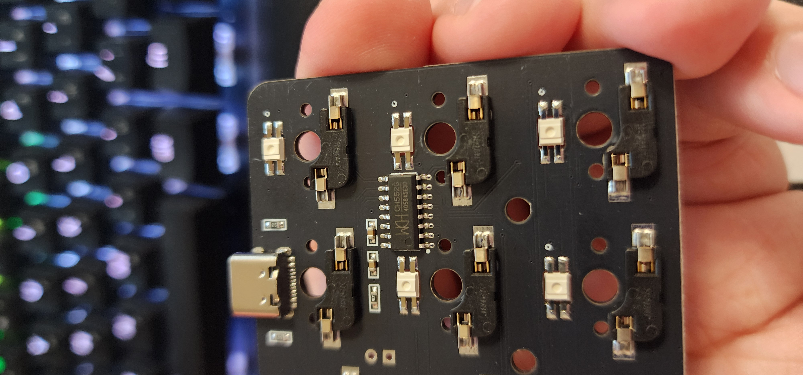
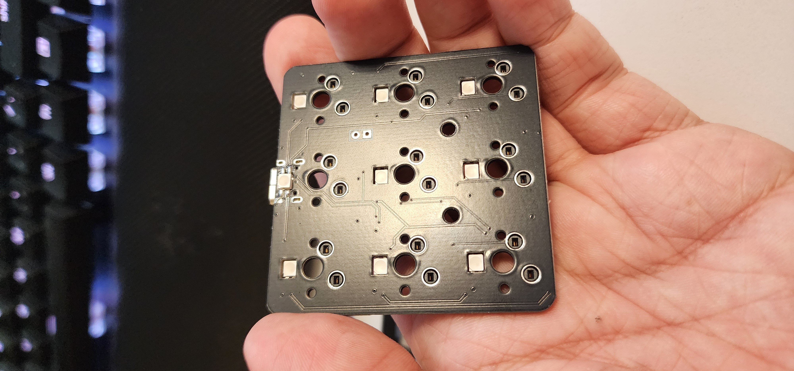
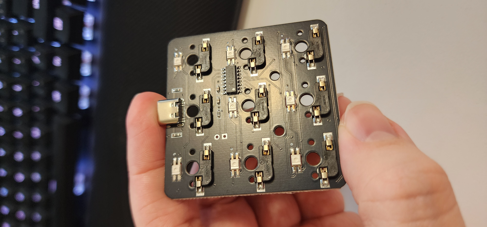
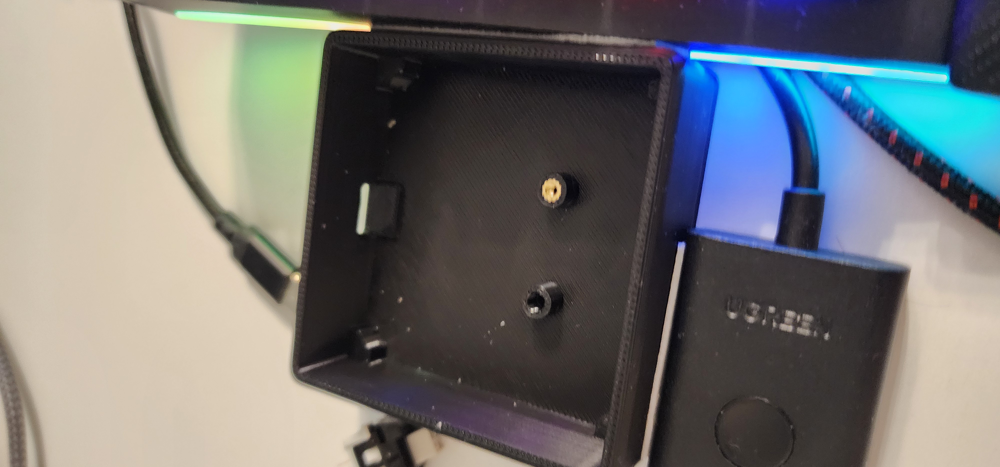
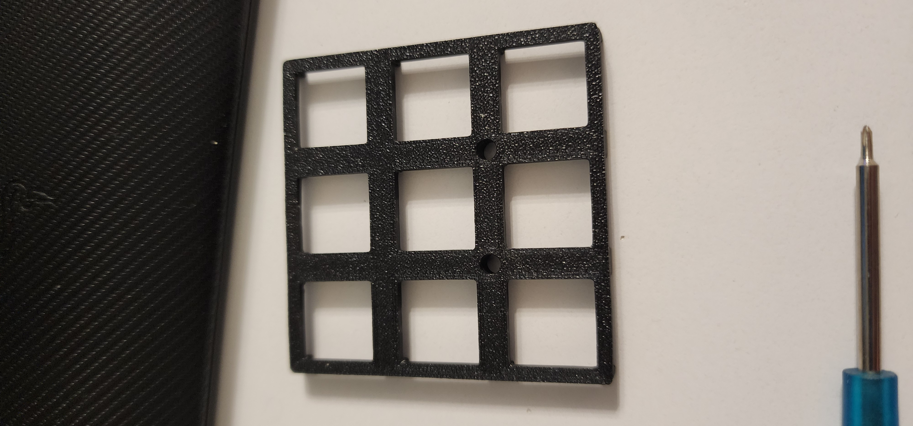
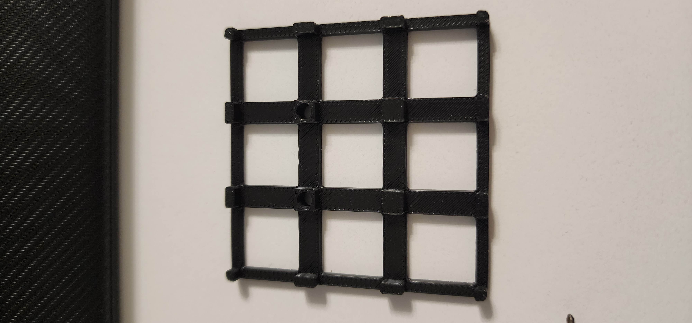

# cv09-via-config

Configure layout and lighting for the CV09 keyboard and probably other devices.

## Why?

My keyboard settings often get reset, and I’m too lazy to open VIA and load my config there; instead, I just run a
single Python script with my settings.

## Quick start

1. Clone the repository.
2. Install Python.
3. Install dependencies:
   ```bash
   pip install -r requirements.txt
   ```
4. [Optional] Add your device definition to the `device/` directory.
5. Edit the `main()` function in `main.py` to set your device and layout.
6. Run the project:
   ```bash
   python main.py
   ```
7. Check layout in `VIA`, check lighting visually

## Sniff keycodes

If you want to sniff keycodes from your device, use `sniffer.py`.

1. Launch [VIA](https://www.usevia.app/), select your device, and open the Configure tab.
2. In `sniffer.py`, set the device in the `main()` function.
3. Run the sniffer:
   ```bash
   python sniffer.py
   ```
4. Press keys or change lighting in `VIA` (or perform other actions).
5. Check the terminal output.

## Information about CV09

-------------

| K                  | V                                                                      |
|--------------------|------------------------------------------------------------------------|
| Chip               | `CH552G`                                                               |
| Port               | `Type-C`                                                               |
| RGB Leds           | `Yes`                                                                  |
| Programmable QMK   | `No`                                                                   |
| Programmable VIA   | `Yes`                                                                  |
| Hot swap           | `Yes`                                                                  |
| Where to buy       | [aliexpress](https://aliexpress.ru/item/0_1005009136123752.html) ~ $12 |
| VIA JSON CN (orig) | [CV09_via_original.json](device/cv09/CV09_via_original.json)           |
| VIA JSON EN        | [CV09_via.json](device/cv09/CV09_via.json)                             |

### Photos

<a href="readme/7.jpg">
  
</a>

<a href="readme/1.jpg">
  
</a>

<a href="readme/2.jpg">
  
</a>

<a href="readme/3.jpg">
  
</a>

<a href="readme/4.jpg">
  
</a>

<a href="readme/5.jpg">
  
</a>

<a href="readme/6.jpg">
  
</a>

